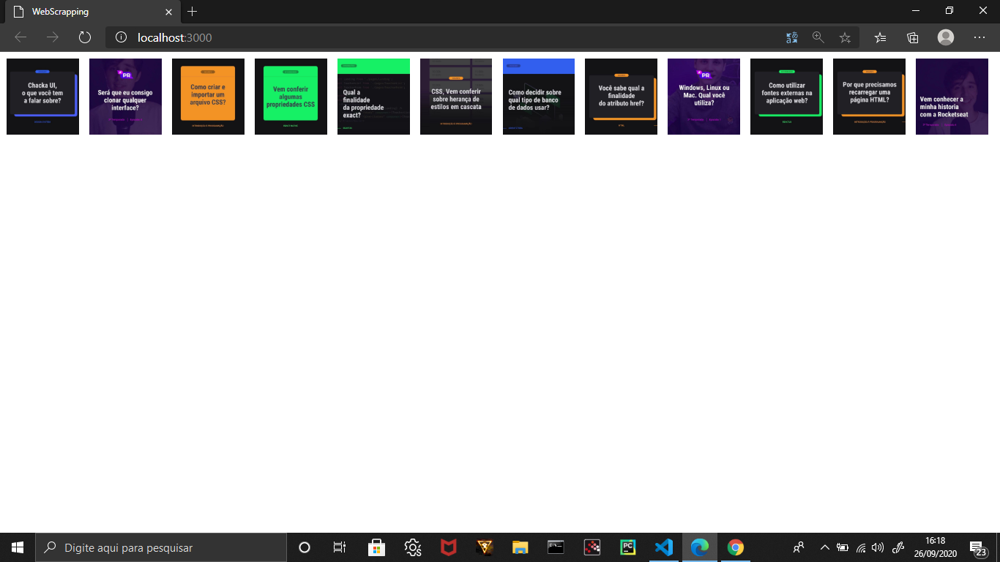

# WebScrapping :camera: :mag:

## Resumo: 
### Esse projeto faz coleta de imagens no instagram armazenando os endereços no arquivo instagram.json.

# PUPPETEER:

### Puppeteer é um pacote que auxilia os aplicativos na busca de páginas da web, bastando colocar a url do site desejado.
### Além disso, o titereiro realiza os seguintes tópicos:
### @ Gera capturas de tela e PDFs de páginas.
### @ Rastreia um SPA (aplicativo de página única) e gera conteúdo pré-renderizado (ou seja, "SSR" (renderização do lado do servidor)).
### @ Automatiza o envio de formulários, testes de IU, entrada de teclado, etc.
### @ Cria um ambiente de teste automatizado e atualizado. Execute seus testes diretamente na versão mais recente do Chrome usando o JavaScript e os recursos do navegador mais recentes.
### @ Captura um rastreamento da linha do tempo do seu site para ajudar a diagnosticar problemas de desempenho.
### @ Testa as extensões do Chrome.

# Projeto:

## O puppeteer é responsável pela mineração de imagens no instagram. Analisando a interface do Instagram você pode ver que as imagens estão associadas na tag do article. O arquivo server.js contém esse trabalho de mineração, além disso, é responsável por armazenar os endereços das imagens em um arquivo JSON. O arquivo index.html é responsável por reproduzir as imagens salvas no arquivo json.

